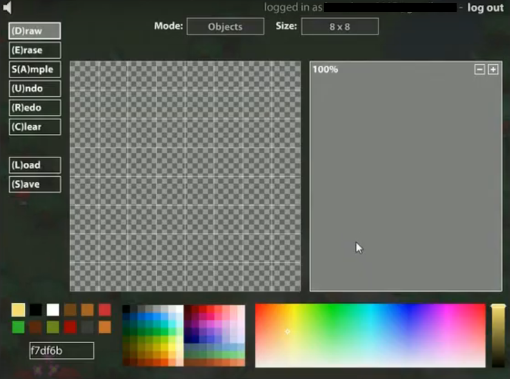
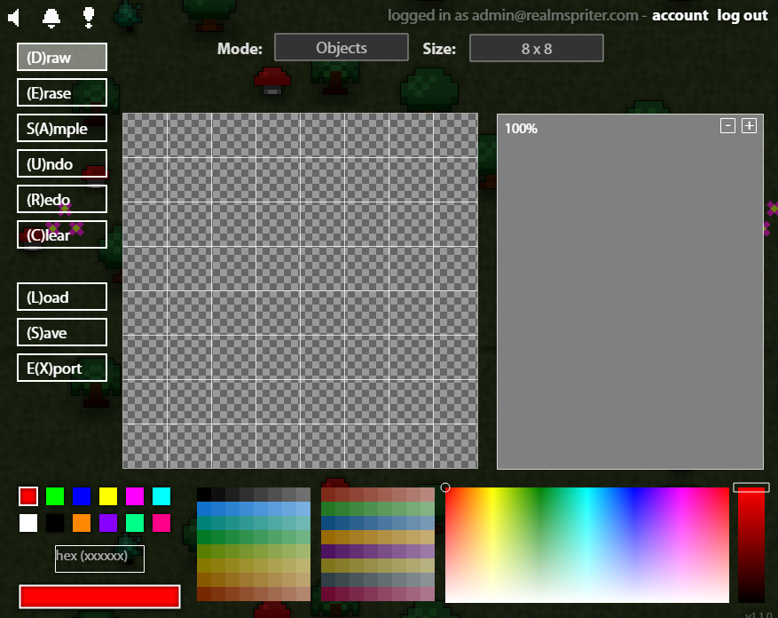
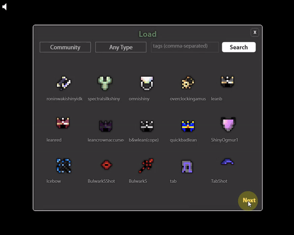

# RealmSpriter — Create & Share pixel art
A faithful recreation of early Wild Shadow RotMG flash Sprite Editor in React-TypeScript.

### Join the community [realmspriter.com](https://www.realmspriter.com/)

## About RealmSpriter

**RealmSpriter** is a fully functional recreation of the flash RotMG sprite editor with color picker, sprite outling, shadows, animations, & more. It supports common realm sprite sizes like 8x8, 16x8, 16x16, and 32x32 with easy extensibility for more sizes, or even non-preset sizes. Includes a working undo/redo history system, offline mode, and browsable database of Realm of the Mad God sprite data up until 2020.

This project aims to not only recreate the original editor, but also expand upon it with more features. Beyond the existing features in the original, RealmSpriter has implemented post comments, likes/dislikes, reporting, and notifications, in addition to a long overdue export button.

Note that this repository contains the client-side codebase for the RealmSpriter platform. In order to make use of backend features (accounts, public posting, etc.), you must implement a functional backend according to the client-sided API calls which are fairly straightforward.

<h4 align="center">Comparison</h4>

Original Editor            |  RealmSpriter
:-------------------------:|:-------------------------:
  |  
<sub>Source — ParaknightROTMG</sub>|

#### Community art
* Browse through pages of user-generated pixel art to remix and share, or view existing RotMG enemy, tile, and item sprites.
* All creations are tagged and categorized for easier naviagation and discovery.



#### Animated Sprites
* Create multi-frame sprite animations using basic draw, erase, and sample actions with more robust editing tools being developed.


#### Exporting
* Creations can be stored remotely within an external database, or locally on your computer.
* Save sprites as PNG or GIF spritesheets, and optionally include outline and dropshadow.


## Build Instructions

### Requirements

- [Node.js](https://nodejs.org/) v20.12.0  
- [Next.js](https://nextjs.org/) v15.0.3  
- [React](https://react.dev/) v18.3.1  

To get started, clone the repository and install the dependencies.  

```bash
git clone https://github.com/MajorH5/realmspriter.git
cd realmspriter
npm install
```

### Development

Start the development server:

```bash
npm run dev
```

This will start a local development server accessible at `http://localhost:3000`.

### Build and Export

To create a production-ready build, run:

```bash
npm run build
```

This will output the built files to the `./build` directory, as configured in the Next.js [config file](/next.config.ts).  
To serve the production build locally:

```bash
npm run start
```

### Production Server with Custom Port

To build and start the app on port `8888`, run:

```bash
npm run prod
```

---

## Contributing  

Want to help make **RealmSpriter** even better? Contributions are welcome!  

### How to Contribute  

- Check out the [Issues](https://github.com/MajorH5/realmspriter/issues) to see what needs work or suggest your own ideas.  
- Fork the repo, make your changes, and submit a pull request.  
- Make sure your code works and is concise—no official standards at the moment, just keep it clean and functional.  

All discussions and updates happen right here on GitHub, so feel free to comment on issues or pull requests if you have questions.

## License  

This project is licensed under the [MIT License](LICENSE), and you are free to share and adapt the work.


